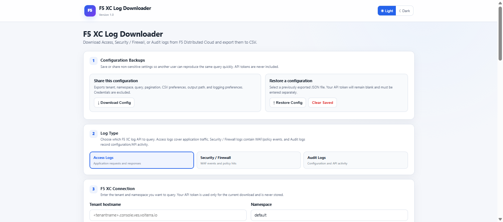
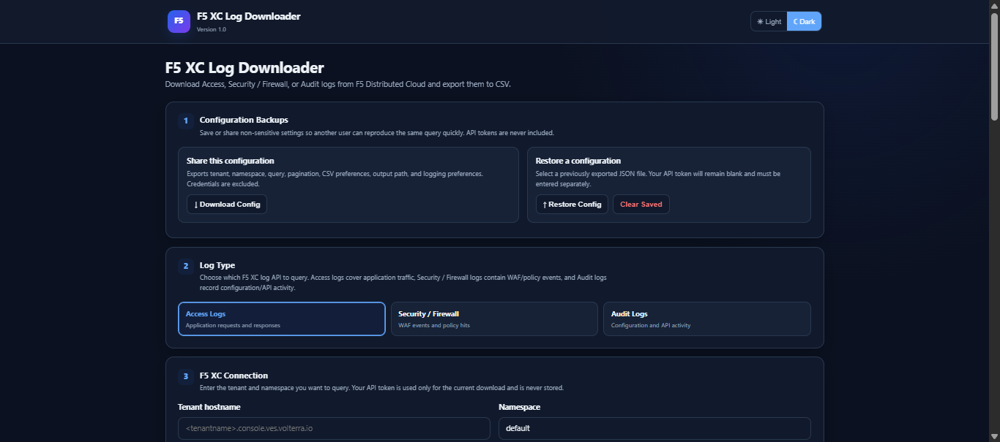
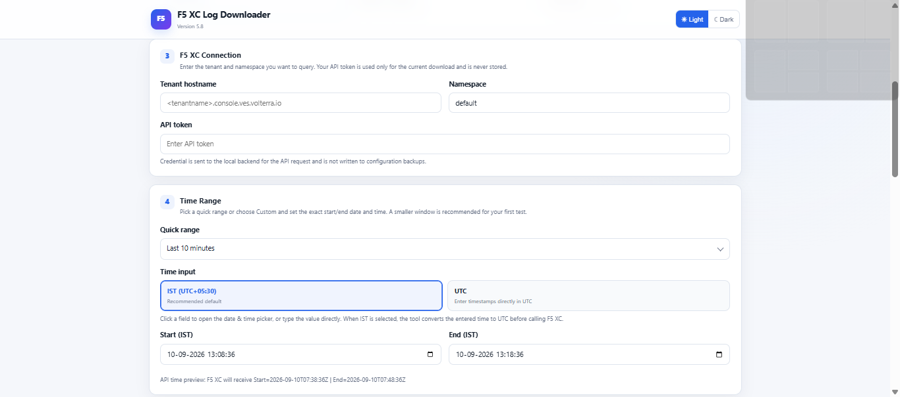
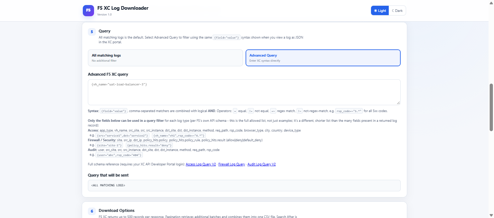
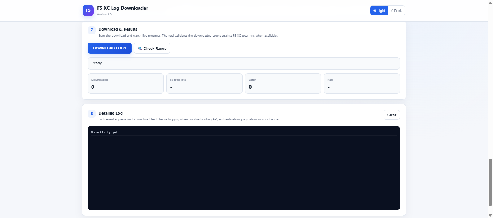

<div align="center">

# F5 XC Log Downloader

**Download Access, Security/Firewall, and Audit logs from F5 Distributed Cloud to CSV using a local desktop GUI, instead of scripting the API directly.**


[Quick Start](#quick-start) • [Features](#features) • [Screenshots](#screenshots) • [Security Warnings](#windows-security-warnings) • [Known Limitations](#known-limitations)

</div>

<br>

A self-contained desktop tool for F5 Distributed Cloud (F5 XC) — formerly known as Volterra — that pulls Access logs, Security/Firewall (WAF) logs, or Audit logs and exports them to CSV, through a local browser-based UI instead of calling F5's REST API directly.

Runs as a small local web app (Python/Flask backend, single-page UI). Can be run from source, or used as a standalone Windows `.exe` built with PyInstaller.

> **F5 XC Log Downloader is an independent community project and is not an official F5 product, nor is it affiliated with or endorsed by F5.**

<br>

## Why this exists

The F5 XC Console provides an easy way to search and download logs, but a single GUI download is limited to 500 logs. For larger investigations, this can mean repeatedly downloading multiple batches.

F5 Distributed Cloud also exposes this same log data through a REST API (`AccessLogQueryV2`, `FirewallLogQuery`, `AuditLogQueryV2`, and their `/scroll` variants), documented at [docs.cloud.f5.com](https://docs.cloud.f5.com/docs-v2/api/log). Working with the API directly means handling authentication, endpoint selection, query syntax, pagination tokens, and JSON responses yourself — reasonable for a script, but overhead if you just want a CSV of last week's WAF events or an audit trail for a review.

This project sits in between: a GUI that picks the right endpoint, handles pagination automatically, and writes a CSV, without requiring API scripting or a Postman collection.

<br>

## Screenshots

<p float="left">
  
  
</p>

<details>
<summary><b>More screenshots</b> — connection &amp; time range, advanced query, download progress</summary>
<br>





</details>

<br>

## Features

| | |
|---|---|
| 🗃️ **All three log types** | Access, Security/Firewall (WAF), and Audit logs — each using F5 XC's documented query syntax |
| 🔄 **Automatic pagination** | Pages through large result sets automatically (Search After, with a fallback to Scroll continuation — see [Known Limitations](#known-limitations)) |
| 🔍 **Advanced filtering** | F5 XC's native `{field="value"}` query syntax, with the documented allowed fields shown inline per log type |
| 📤 **CSV / full JSON export** | Plus an always-on activity/debug log for troubleshooting |
| 📊 **Live progress** | Pause / resume / stop, with count validation against F5's own reported `total_hits` |
| 💾 **Config backup/restore** | Export and share non-sensitive settings (API tokens are excluded) as a JSON file |
| 📁 **Native OS folder picker** | A native Windows folder dialog for the output directory |
| ⚡ **"Check Range"** | One-click probe that reports whether F5 XC will accept a given time range/log type, and how many records are available, before running a full download |
| 📦 **Standalone Windows executable** | Can be packaged so recipients don't need Python or any dependencies installed |

<br>

## Quick start

<details open>
<summary><b>Option A — run the prebuilt Windows EXE</b></summary>
<br>

Download `F5XC-Log-Downloader v1.0.exe` from the [latest Release](../../releases/latest), double-click it, then open `http://127.0.0.1:5000` in your browser.
</details>

<details>
<summary><b>Option B — run from source</b></summary>
<br>

```bash
pip install flask requests
python f5xc_log_downloader.py
```
Then open `http://127.0.0.1:5000`.
</details>

<details>
<summary><b>Option C — build your own EXE (Windows)</b></summary>
<br>

```
build_windows_exe.bat
```
This installs Flask/Requests/PyInstaller if needed, builds a onefile EXE, and drops it in `release\F5XC-Log-Downloader.exe`.
</details>

<br>

## Windows security warnings

The prebuilt Windows executable is currently unsigned because it does not use a paid code-signing certificate.

As a result, Windows SmartScreen or antivirus software may display warnings when you run the executable.

This does not by itself indicate that the application is malicious. However, users should follow their organization's security procedures when evaluating software.

If you do not want to run the prebuilt executable, you can build the application yourself from the source code in this repository (see [Option C](#quick-start) above).

<br>

## How it works

The tool is a single Python file running a local Flask server, with the entire UI (HTML/CSS/JS) served from one template — no separate frontend build step. Log type, time range, and query selections made in the UI are translated into the corresponding F5 XC API request server-side.

<br>

## Credentials & data handling

The application is designed to operate locally.

Your F5 XC API credentials are used by the application to authenticate requests to F5 Distributed Cloud.

API credentials are not sent to the project author or to a separate third-party service by the application.

Configuration backups intentionally exclude API tokens and other sensitive authentication information.

Downloaded logs are saved locally to the output location selected by the user.

The project does not operate a separate server-side service for collecting or storing downloaded log data.

Users are responsible for ensuring that they have appropriate authorization to access and export the F5 XC data retrieved using the application.

<br>

## A real debugging story

*(why this is more than a form wrapper)*

The application encountered a restriction on how far back a query's `start_time` could be set. The behavior did not appear to be represented in the published API schema, so it was investigated through direct testing — including ruling out an incorrect initial theory (that it was a maximum *range width*) before narrowing it down to a restriction on how *old* `start_time` is allowed to be, regardless of the window's width. This is documented in more detail in [CHANGELOG.md](CHANGELOG.md).

This behavior is based on testing against the F5 XC environment during development and should not be interpreted as an official F5 platform specification. The "Check Range" feature exists because of this finding — it lets you probe the current behavior for a given time range and log type in one click, instead of waiting through a failed multi-minute download.

<br>

## Known limitations

- A restriction was observed on how old a query's `start_time` can be (it appears to vary by log type). This is based on testing, not on documented F5 platform behavior. The tool surfaces F5's rejection message directly and offers "Check Range" to check the current behavior quickly, but cannot bypass this restriction — it is a platform-side constraint, not something the client can work around.
- A `scroll_id` (used for large result sets) is only valid for approximately 2 minutes between requests, per F5's own schema documentation — pausing a large download for longer than that may require restarting it.
- Built and tested against F5 XC's Log Query V2 / Scroll API family; other F5 XC log APIs (e.g. Application Security Monitoring) are not currently used by this tool.
- The prebuilt Windows executable is unsigned (see [Windows security warnings](#windows-security-warnings) above).

<br>

## License

MIT — see [LICENSE](LICENSE).

<br>

## Contributing

Issues and pull requests are welcome. This started as a focused, single-purpose tool, so contributions that keep it dependency-light and in scope (F5 XC log retrieval and export) are easiest to merge.

<br>

## F5 Distributed Cloud API

This tool is built against F5 Distributed Cloud's published Log Query API family — `AccessLogQueryV2`, `FirewallLogQuery`, `AuditLogQueryV2`, and their `/scroll` variants — documented at:

[https://docs.cloud.f5.com/docs-v2/api/log](https://docs.cloud.f5.com/docs-v2/api/log)

See [A real debugging story](#a-real-debugging-story) above for one case where observed behavior didn't fully align with the published schema.

<br>

## Disclaimer

**F5 XC Log Downloader is an independent community project and is not an official F5 product, nor is it affiliated with or endorsed by F5.**

F5, F5 Distributed Cloud, and related names are trademarks of F5, Inc. They are used in this project solely to identify the platform and APIs with which the tool is designed to work.

Users are responsible for ensuring that they have appropriate authorization to access and export data using the application and for handling exported log data in accordance with their organization's security and data-handling policies.

<br>

## Download

The latest release, **v1.0.0**, is available on the [Releases](../../releases/latest) page, including the prebuilt Windows executable `F5XC-Log-Downloader v1.0.exe`.

<br>

## Development

This project was built with [Claude](https://www.anthropic.com/claude) (Anthropic) as an AI pair-programmer — code generation, debugging assistance, and documentation drafting were AI-assisted throughout. The requirements, feature direction, and validation were mine: every fix in this repo (including the debugging story above) came from hands-on testing against the F5 XC API and cross-checking behavior against F5's official API documentation, not from taking AI-generated output at face value.

<br>

## Feedback

Bug reports and feature requests are welcome via [GitHub Issues](../../issues).
